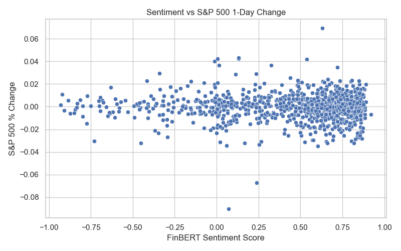
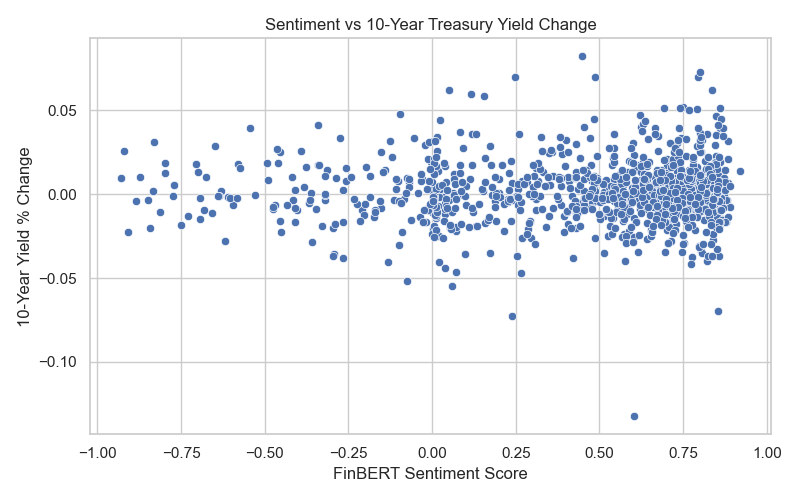

# 📈 Event-Driven Sentiment: Analyzing Fed Statements with Machine Learning

This project analyzes whether the **tone of U.S. Federal Reserve policy statements** can explain or predict **short-term movements in financial markets**, specifically:

- 📉 **S&P 500 index** returns  
- 💵 **10-year U.S. Treasury yields**

To measure sentiment, I use the **FinBERT** transformer model from Hugging Face, fine-tuned on financial texts.

---

## 🔍 Main Results

### 💬 Sentiment vs. S&P 500 Change (Next Day)



> The relationship is weak and noisy. Most statements are neutral, and there's no clear upward or downward trend.

---

### 💬 Sentiment vs. 10-Year Treasury Yield Change



> No meaningful correlation observed. Market reaction may reflect expectations or occur intraday.

---

### 📄 Regression Output: S&P 500 ~ Sentiment Score

```
                            OLS Regression Results                            
==============================================================================
Dep. Variable:           sp500_change   R-squared:                       0.000
Model:                            OLS   Adj. R-squared:                 -0.001
Method:                 Least Squares   F-statistic:                    0.2111
Date:                Mon, 23 Jun 2025   Prob (F-statistic):              0.646
Time:                        08:37:53   Log-Likelihood:                 3237.4
No. Observations:                1062   AIC:                            -6471.
Df Residuals:                    1060   BIC:                            -6461.
Df Model:                           1                                         
Covariance Type:            nonrobust                                         
===================================================================================
                      coef    std err          t      P>|t|      [0.025      0.975]
-----------------------------------------------------------------------------------
const           -3.743e-05      0.001     -0.070      0.944      -0.001       0.001
sentiment_score     0.0004      0.001      0.459      0.646      -0.001       0.002
==============================================================================
```

> FinBERT sentiment score was not significantly associated with S&P 500 returns. R² ≈ 0. Most statements were neutral in tone.

---

### 📄 Regression Output: 10Y Treasury Yield ~ Sentiment Score

```
                            OLS Regression Results                            
==============================================================================
Dep. Variable:             tnx_change   R-squared:                       0.000
Model:                            OLS   Adj. R-squared:                 -0.001
Method:                 Least Squares   F-statistic:                    0.2570
Date:                Mon, 23 Jun 2025   Prob (F-statistic):              0.612
Time:                        08:44:12   Log-Likelihood:                 2749.0
No. Observations:                1060   AIC:                            -5494.
Df Residuals:                    1058   BIC:                            -5484.
Df Model:                           1                                         
Covariance Type:            nonrobust                                         
===================================================================================
                      coef    std err          t      P>|t|      [0.025      0.975]
-----------------------------------------------------------------------------------
const               0.0009      0.001      1.012      0.312      -0.001       0.003
sentiment_score     0.0007      0.001      0.507      0.612      -0.002       0.003
==============================================================================
```

> The sentiment score was also not significantly associated with 10-year Treasury yield changes. The R² remains near zero, suggesting no explanatory power in either direction.

---

## 🛠️ What This Project Does

- Loads historical FOMC policy statements (1994–2022)
- Applies FinBERT to extract directional sentiment:  
  `sentiment_score = P(positive) - P(negative)`
- Collects next-day S&P 500 and 10-year Treasury yield data
- Regresses market movements on sentiment

---

## 🧠 Interpretation

- Most statements are technocratic and neutral by design  
- FinBERT, while trained on financial news, may not capture subtle central bank shifts  
- Market response is likely intraday, or already priced in based on expectations  

Still, the project demonstrates how to:
- Apply transformer models (FinBERT) to real-world financial text  
- Align textual sentiment with market-level time series  
- Handle event-based prediction with economic data  

---

## 🗂 Project Structure

```
central-bank-nlp-sentiment/
├── fed_sentiment_analysis.ipynb       # Main notebook  
├── data/
│   └── FOMC_statements.csv            # Input text data  
├── results/
│   ├── plot_sentiment_sp500.png       # S&P 500 scatterplot  
│   ├── plot_sentiment_tnx.png         # 10Y yield scatterplot  
│   ├── fed_sentiment_market.csv       # Output data  
│   └── regression_summary_sp500.txt   # Full regression output (text file)  
├── requirements.txt                   # Python dependencies  
└── README.md                          # This file  
```

---

## 📦 Tools & Libraries

- Python (pandas, matplotlib, seaborn)  
- transformers + torch (FinBERT sentiment analysis)  
- yfinance (market data)  
- statsmodels (regression)